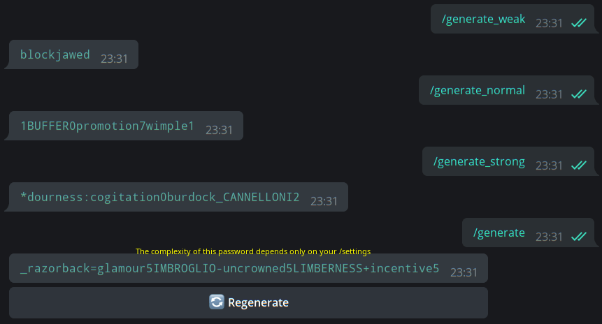
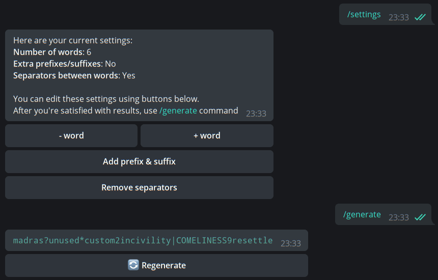
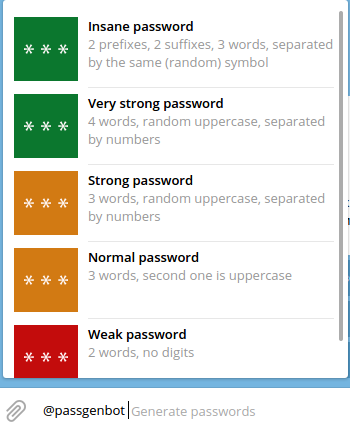

# <p align="center">  Readable Passwords Generator for Telegram #

This bot allows you to generate readable passwords directly from Telegram without necessity to open external utilities such as KeePass. An inspiration for this bot came from famous [XKCD 936](http://xkcd.com/936/) strip.  
Try it now: https://t.me/passgenbot

### Features 
* Presets of different complexity;
* Ability to generate customized password;  
* Inline mode with colored complexity;  
* No personal data is collected!  
* Basic multilanguage support (En+Ru), depending on `language_code` from Bot API;  
* [Docker support](#docker)

### Requirements
* Python 3.7+  
* [aiogram](https://github.com/aiogram/aiogram) – Telegram Bot API framework;  
* [Redis](https://redis.io) as backend for aiogram's finite state machine (FSM);  
* [XKCD-password-generator](https://github.com/redacted/XKCD-password-generator) – It goes without saying :)

You can install all these requirements with `pip install -r requirements.txt` command. Redis must be done separately 
(or will be automatically pulled if using [Docker](#docker) method below)

### Presets
 

`/generate_weak` – 2 words, no digits or separators between words  
`/generate_normal` – 3 words, random UPPERCASE, separated by numbers
`/generate_strong` – 4 words, random UPPERCASE, separated by numbers or special characters  

### Customized Passwords

  

With `/settings` command you can customize generated passwords. Currently supported settings are number of words (2 to 8), 
prefixes and suffices in the beginning and in the end of password and separators between words in password. 
Then just use `/generate` command to create password based on your settings.

### Inline mode



You can also use this bot in inline mode. An indicator on the left shows rough password complexity (green is good, red is not).

### Docker

This bot supports deployment via docker-compose. First create a directory structure for your bot, e.g.:  
```bash
mkdir -p /opt/passgenbot/{bot-config,redis-config,redis-data}
touch /opt/passgenbot/bot-config/config.ini
```

`bot-config` directory contains `config.ini` file.  
`redis-config` directory contains custom config file for Redis. If you don't place anything here, the following config 
will be used:  
```
port 6379
save 600 1
dbfilename redis_dump.rdb
```
`redis-data` directory contains your database file. You can place your own one if migrating from other bot's instance. 
Don't forget to update `redis.conf` file if you rename or move your database file. 


Use [config.example.ini](https://github.com/MasterGroosha/telegram-xkcd-password-generator/blob/master/config/config.example.ini) as an example 
for your own configuration file, then place [docker-compose.yml](https://github.com/MasterGroosha/telegram-xkcd-password-generator/blob/master/docker-compose.yml) file 
next to other created directories and start your bot using `docker-compose up -d` command. Check logs using `docker-compose logs`.