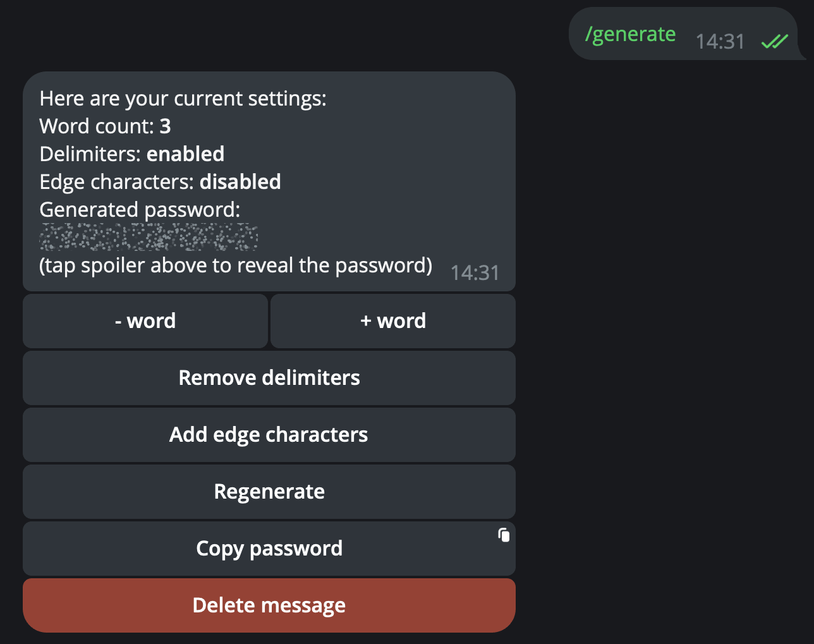
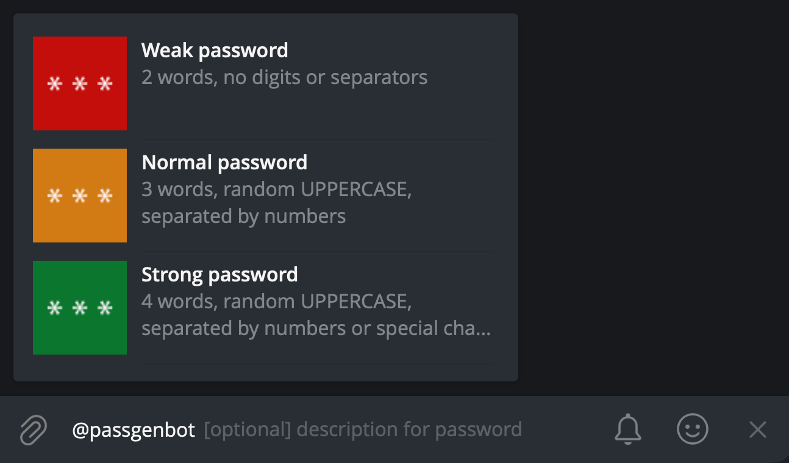
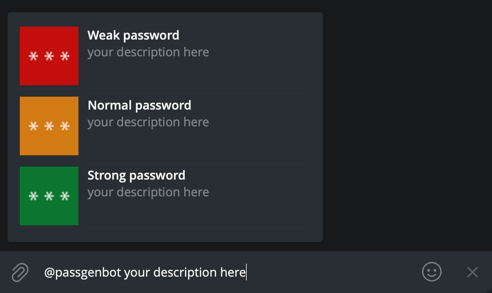

# <p align="center">  Readable Passwords Generator for Telegram #

This bot allows you to generate readable passwords directly from Telegram without necessity to open external utilities such as KeePass. An inspiration for this bot came from famous [XKCD 936](http://xkcd.com/936/) strip.  
Try it now: https://t.me/passgenbot

### Features 
* Presets of different complexity;
* Ability to generate customized password;  
* Inline mode with colored complexity;  
* No personal data is collected!  
* Basic multilanguage support (En+Ru), depending on `language_code` from Bot API;  

### Requirements
* Python 3.14+  
* [aiogram](https://github.com/aiogram/aiogram) – Telegram Bot API framework;  
* [XKCD-password-generator](https://github.com/redacted/XKCD-password-generator) – the library behind XKCD-style password generation
* uv

### Setup

1. Clone the repository and enter the project directory.
2. Copy `settings.example.toml` to `settings.toml` and fill in the values:
   - `bot.token` — your Telegram bot token from [@BotFather](https://t.me/BotFather)
   - `xkcd.wordfile` — absolute path to `words.txt` (included in the repo)
3. Install dependencies: `uv sync`

### Running

```bash
uv run -m bot
```

### Running via systemd

For a persistent deployment on a Linux server, a sample unit file is provided at `passgenbot.example.service`.

1. Copy and edit the file:

```bash
cp passgenbot.example.service /etc/systemd/system/passgenbot.service
# Edit User=, WorkingDirectory=, and ExecStart= to match your setup
nano /etc/systemd/system/passgenbot.service
```

2. After the first `uv sync`, the virtual environment is created at `.venv/`. Set `ExecStart` to:

```
ExecStart=/path/to/passgenbot/.venv/bin/python -m bot
```

3. Enable and start the service:

```bash
systemctl daemon-reload
systemctl enable --now passgenbot
```

Check status with `systemctl status passgenbot` and logs with `journalctl -u passgenbot -f`.

### Generating passwords

Use `/generate` to create a password. The bot replies with the password and an inline keyboard that lets you adjust it on the fly:



* **− Word / + Word** — decrease or increase the number of words (2 to 5);
* **Show/Hide delimiters** — toggle digit separators between words;
* **Add/Remove edge** — add or remove a delimiter at the beginning and end of the password;
* **Regenerate** — generate a new password with the same settings;
* **Copy** — copy the password to clipboard (Telegram native button);
* **Delete** — remove the message.

### Inline mode



When the query is empty, descriptions show preset details; when it is not, the query itself is shown as the description.



You can also use this bot in inline mode. An indicator on the left shows rough password complexity (green is good, red is not).

## Running tests

The project uses [pytest](https://pytest.org) with [uv](https://github.com/astral-sh/uv) as the package manager.

```bash
uv run pytest tests/
```

Add `-v` for verbose output:

```bash
uv run pytest tests/ -v
```

## Versioning

This project uses Calendar Versioning with the following rules:

* Versions should look like `vAAAA.BB.C`, where:
  * `vAAAA` is the letter "v" followed by the 4-digit year of release, e.g., `v2026`.
  * `BB` is the 2-digit month number, e.g., `05` for May.
  * `C` is the release number for that month, not zero-padded, e.g., 1 for the first release in May.

For example, the first release to use the new versioning schema is `v2026.05.1`.

This scheme makes it easier to understand which Bot API features might be supported in a given release and which are definitely not.
